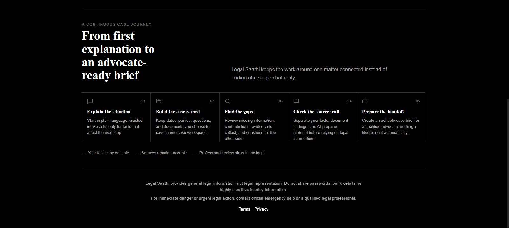
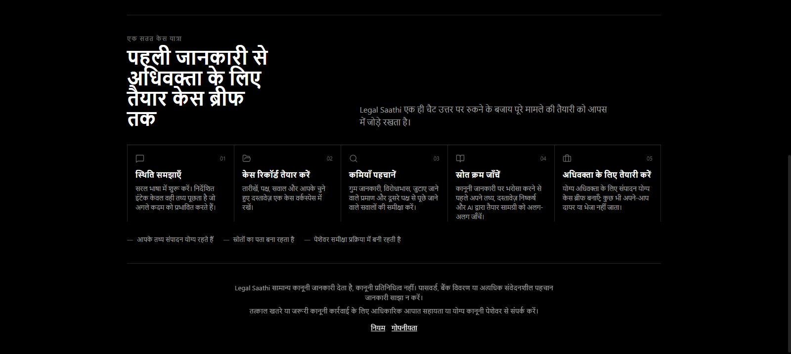
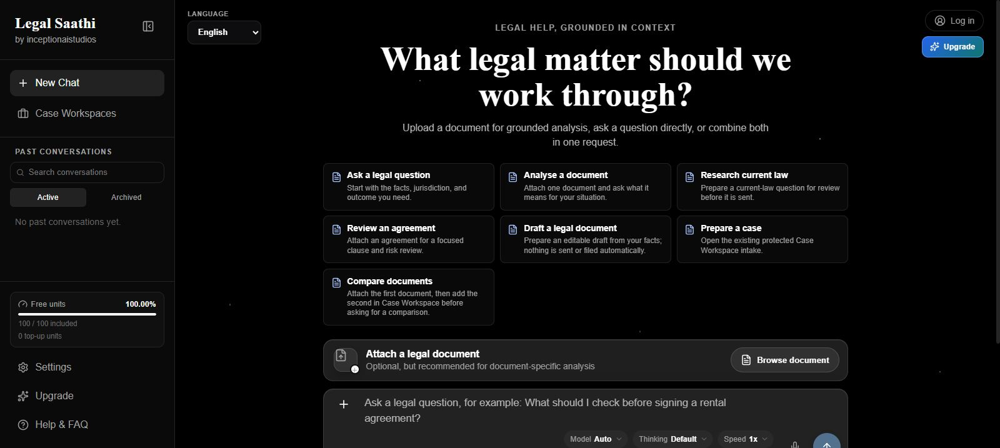

# Legal Saathi

Legal Saathi is a unified Next.js legal AI workspace with an adapted Express backend.

## Live demo and review scope

- Original demo domain: [legalsaathi-india.vercel.app](https://legalsaathi-india.vercel.app/)
- Start with either **I Need Legal Help** or **I'm a Legal Professional**. Both public entry paths explain the legal-information boundary, sensitive-data guidance, and available language options.
- Legal Saathi provides general legal information and preparation support. It is not legal representation, and urgent matters should go to official emergency help or a qualified legal professional.

The public interface shows feature availability instead of pretending a disconnected provider, Web source, account, plan, payment, upload, or case feature is working. Protected features are described as verified only after a separately recorded synthetic-data check.

## Try the public journey in 60 seconds

For this checkout, the public guide route is `/how-it-works`. Include it in the
original-domain demo only after the exact reviewed release is deployed and
verified.

1. Start at the original demo domain and choose **I Need Legal Help** or
   **I'm a Legal Professional**.
2. Switch the interface between English, Hindi, and Hinglish.
3. Open **How Legal Saathi works** to see the public first-use boundary,
   privacy guidance, a fictional example, and the difference between publicly
   explorable UI and account/configuration-dependent features.
4. Read Terms, Privacy, Disclaimer, and Support before using any legal output
   for a real decision.

Use fictional, non-sensitive examples for testing. A feature shown as
unavailable is not evidence that the provider, account, document, case, or
payment workflow is enabled in that environment.

## One matter, one preparation journey

Legal Saathi is designed around continuity rather than a one-shot legal-chat
answer. Its public case journey explains five connected stages:

1. explain the situation in plain language;
2. organise dates, parties, questions, and documents in one case record;
3. identify missing information, contradictions, and evidence to collect;
4. check the source trail before relying on legal information; and
5. prepare an editable handoff for a qualified advocate.

The interface keeps a visible review boundary throughout this journey. User
details may be unverified, document findings should be checked against the
cited source or page, and AI-prepared structure requires qualified review
before legal action. Legal Saathi does not file, send, pay, contact, publish,
or represent a user.

### Release screenshots

These screenshots were captured from the release serving the original domain.
They use only signed-out, public, or fictional states.

| English case journey | Hindi case journey |
|---|---|
|  |  |



## Project layout

```text
LEGAL_SATHI_RAW_WEBSITE_RUN/
|-- app/                 Next.js pages and server routes
|-- components/          Website and case-workspace UI
|-- lib/                 API client, session-safe UI state, and document services
|-- backend/             Adapted Legal Saathi API, AI safety, RAG, auth, and payments
|-- scripts/dev.mjs      Starts the website and backend together
```

The original backend source and the `old-backend-reference` copy are outside this folder and are not modified by the integrated app.

## Install

```powershell
npm.cmd ci --ignore-scripts
npm.cmd --prefix backend ci --ignore-scripts
```

These reproducible fresh-clone commands respect the committed lockfiles and do
not run package lifecycle scripts during installation. Do not use `npm audit
fix` blindly; review dependency updates in an isolated worktree first.

## Run locally

```powershell
npm.cmd run dev
```

- Website: `http://localhost:3001`
- Backend health: `http://localhost:8000/health`

Development can use explicit mock mode only when the operator enables it. Missing or unfunded AI providers return a safe setup/payment-required error; they never produce a fabricated legal answer.

## Configuration

Use only an owner-reviewed safe configuration template for this checkout when
creating local `.env` files. Never copy environment values from another
project, commit an `.env` file, or place AI provider, Supabase service-role,
Razorpay secret, webhook, or admin-session values in the frontend environment.

Real services require backend-only configuration:

- OpenRouter for substantive AI responses.
- Google OAuth for production identity verification.
- Supabase for persistent profiles, cases, quotas, and admin data.
- Razorpay for real orders and verified payments.

## Local and production controls

Development stores signed session records, preview profiles, plans, usage counters, coupons, incidents, cases, and payment metadata on the local backend under `backend/.local/`. The browser receives an HttpOnly signed session cookie and keeps only temporary UI state in memory. Production fails closed unless persistent adapters are configured.

- Loopback development sign-in is visibly development-only and disabled in production. Google sign-in requires a valid public `GOOGLE_CLIENT_ID`; Google passwords and app secrets never enter the frontend.
- Add AI provider credentials only in `backend/.env`, set `MOCK_MODE=false`, and allowlist the intended provider. Provider billing failures return `AI_PROVIDER_PAYMENT_REQUIRED` and refund reserved units once.
- RAG has separate curated global and owner/case/document private scopes. Development uses deterministic local embeddings and stores; production requires Supabase hybrid retrieval and Vertex embeddings.
- Live search supports an approved OpenRouter native Web tool or Tavily. Search queries are minimized/redacted and citations are restricted to approved official sources.
- Real Razorpay requires backend-only `RAZORPAY_KEY_ID` and `RAZORPAY_KEY_SECRET`. The server creates the order and verifies its signature before access changes. Local test mode never grants a paid tier.
- Select **Owner access** from the signed-in profile menu to open Admin. Production requires the authorized Google admin identity; development can use backend-only owner credentials.
- Before chat, the user must accept versioned Terms & Safety consent stored with the backend session.
- App-managed TOTP remains visibly `Setup required` until encrypted persistent storage and a reviewed primary-login challenge are complete. See `docs/TWO_FACTOR_SETUP.md`.
- Safe incidents contain request references and operational categories only. They exclude prompts, documents, audio, plaintext email, cookies, tokens, secrets, stack traces, and provider bodies.
- Public health output is minimal. Detailed configuration status is development/admin-only and never returns credential values.

### Google Identity origins

For a configured local Google Identity client, add these Authorized JavaScript origins in Google Cloud Console:

- `http://localhost`
- `http://localhost:3001`

Before any production deployment, rotate any payment credentials that may have appeared in screenshots or shared material, even if they were test keys.

## Production execution

Never publish `next dev`. A public frontend uses:

```powershell
npm.cmd run build:web
npm.cmd run start -- -p 3001
```

The Express backend is built separately with `npm.cmd run build:backend` and must run behind an approved HTTPS/private service boundary. The allowlisted same-origin Next.js BFF forwards only approved routes and bounded bodies. Production does not fall back to `localhost`, local JSON stores, mock AI, development sign-in, or simulated payment.

## Checks

```powershell
npm.cmd exec -- tsx lib/legalCaseJourney.test.ts
npm.cmd run typecheck
npm.cmd run lint
npm.cmd run build
```

## Stardance evidence policy

The app is presented through the original domain above. A submission must only claim what its current release proves:

- Public onboarding, policy pages, language controls, safe first-use guidance, and visible availability states can be demonstrated without real legal data.
- Sign-in, AI responses, Web citations, document uploads, case storage, billing, and payments require separate hosted checks using a disposable account and synthetic data before they appear in a public demo, devlog, or Ship form.
- Tracker-accepted hours are kept separate from earlier work evidenced by Git history; older work is not represented as accepted tracker time.
- Development has used AI assistance. Product decisions, source integration, testing, and factual documentation are reviewed by the project owner; AI use is disclosed honestly where the platform requests it.

See [Project limitations](docs/PROJECT_LIMITATIONS.md) for the public-safe
legal, privacy, testing, and evidence boundaries that should accompany a
future public source release.

The Express backend owns authenticated document processing, OCR, legal chat, safety, retrieval, user/admin security, cases, incidents, usage, and payment verification. Next.js route handlers are an allowlisted same-origin BFF and raw-body webhook relay, not an authorization boundary of their own.
